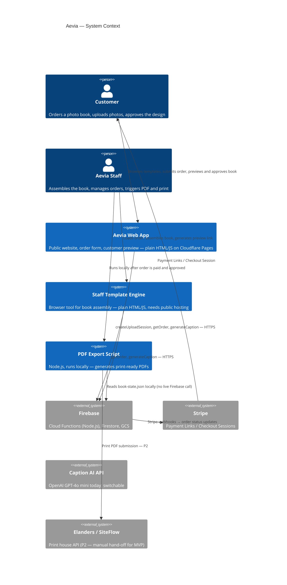

# Aevia — Architecture

**Status:** Active  
**Date:** 2026-05-28  
**PRD:** `PRD.md`  
**Journey:** `context/customer-journey-v1.md`

---

## Overview

Aevia is a premium photo book service. The system is a semi-automated production pipeline: customers order and upload online; Aevia founders assemble the book in a browser-based staff tool; customers preview and approve via a limited version of the same tool; payment is collected; a Node.js script generates the print-ready PDF.

The codebase is a **plain HTML/CSS/JS multi-page web application** — no framework, no build step, no bundler. This is an intentional constraint for a two-person team: zero build tooling means zero build tooling problems. The backend is Firebase (Cloud Functions + Firestore + GCS). The PDF export runs as a local Node.js script.

The system has five distinct surfaces inside one repository:

| Surface | Audience | Hosting |
|---|---|---|
| Public website | Customers | Cloudflare Pages |
| Order form | Customers | Cloudflare Pages |
| Staff template engine | Founders (Evgenii, Xenia) | Cloudflare Pages (staff subdomain, Cloudflare Access) |
| Staff dashboard | Founders | Cloudflare Pages (staff subdomain, Cloudflare Access) |
| Customer preview engine | Customers (post-assembly) | Cloudflare Pages |

> **Reading the diagram:** This is a Mermaid C4 diagram. To preview it visually: paste the block at [mermaid.live](https://mermaid.live), open this file in VS Code with the "Markdown Preview Mermaid Support" extension (`Ctrl+Shift+V`), or push to GitHub (renders automatically).

---

## System Diagram



---

## Codemap

```
aevia-test/
│
├── pages/                          Public + staff HTML pages (selection of key files below)
│   ├── home.html                   Marketing homepage
│   ├── collections.html            Template catalogue
│   ├── scribble.html               Scribble product page (one per template at MVP)
│   ├── [template].html             Additional template product pages — one per template
│   ├── order.html                  Order form — all templates, Step 1+2 flow
│   ├── staff/                      Staff-only pages (relocated 2026-06-02, chunk-009 prep)
│   │   ├── template-engine.html    Staff assembly tool — loads order, drag-drop, captions
│   │   └── dashboard.html          Staff order dashboard — status, list, actions
│   └── customer-preview.html       Customer limited engine — view/edit/approve via ?token=
│
├── assets/
│   ├── Template_Scribble/          One folder per template — pattern repeats for all 9
│   │   ├── scribble-data.js        Generated template data file (do not hand-edit)
│   │   ├── Scribble_sizing_full.csv  Source of truth for spread layout
│   │   ├── Scribble_Template_Sizing_Cover.csv  Source of truth for cover layout
│   │   └── *.svg                   Spread and cover artwork
│   ├── Template_[Name]/            Future templates follow the same structure
│   │   ├── [name]-data.js
│   │   ├── [Name]_sizing_full.csv
│   │   ├── [Name]_Template_Sizing_Cover.csv
│   │   └── *.svg
│   ├── fonts/                      Shared font files (TTF/OTF only — no woff2, no variable fonts)
│   └── templates.json              Template catalogue (name, slug, page counts)
│
├── functions/                      Firebase Cloud Functions
│   ├── index.js                    Function entry points (exports)
│   ├── upload.js                   createUploadSession — order creation, GCS upload, emails
│   ├── caption/
│   │   ├── generateCaption.js      AI caption generation
│   │   └── caption-voice.md        Caption tone-of-voice rules (read at runtime)
│   ├── package.json
│   └── .env                        Secrets — NOT in git
│
├── scripts/
│   └── export-pdf.js               Print-ready PDF generation (pdf-lib + sharp, runs locally)
│
├── csv-to-template.js              Regenerates <template>-data.js from CSV — run after CSV edits
├── PRD.md                          Product requirements
├── ARCHITECTURE.md                 This file
└── context/
    ├── customer-journey-v1.md      End-to-end flow with build status per step
    ├── design-principles.md        Brand rules — spacing, colour, typography
    └── style-guide.md              Nav/footer patterns, page inventory
```

---

## Key Patterns

### Template-as-data-file

Every template is defined by a `<name>-data.js` file (e.g. `scribble-data.js`) containing all spread types, slot coordinates, SVG paths, background colours, caption positions, and addon (functional page) flags. The engine, order form, and PDF script all read from this file — they contain no template-specific logic.

**Source of truth:** CSV files (`Scribble_sizing_full.csv`, `Scribble_Template_Sizing_Cover.csv`). Run `node csv-to-template.js` after editing the CSV to regenerate the data file.

Adding a new template = new CSV pair + new data file + new product page. No pipeline code changes required.

### Three-mode engine

`template-engine.html` has two operating modes today (Local / Order load) and will gain a third:

| Mode | Audience | Access | Photos from |
|---|---|---|---|
| Local | Aevia staff | Staff auth | Local file upload |
| Order | Aevia staff | Staff auth | GCS via signed URLs |
| Customer preview | Customer | Per-order token | GCS via signed URLs |

Customer mode disables: spread reorder/swap, AI caption button, export. Enables: thumbnail drag-drop, caption text edit, FP text panel edit, "Approve" button + "Submit changes" button.

**UX note:** The current engine UI is designed for staff use and is acceptable internally. Customer mode will likely require UX rework — simpler layout, clearer guidance, premium feel consistent with the public site. This may mean a distinct visual skin for customer mode rather than just toggling feature flags. Scope of UX changes is TBD.

### Firebase backend

All backend logic lives in Firebase Cloud Functions (Node.js, `europe-west1`). No custom server. Functions called directly over HTTPS from the browser — no API gateway.

Key functions:
- `createUploadSession` — creates order, generates signed PUT URLs, saves to Firestore + GCS, sends emails
- `getOrder` — staff/customer fetch: returns order metadata + signed GET URLs (1h). Staff auth via Firebase ID token (`Authorization: Bearer`, allowlisted email — chunk-018) or legacy `X-Staff-Key` (PDF CLI only); customer auth via `?token=` UUID param (see ADR-0002)
- `generateCaption` — proxies photo to caption AI, returns suggestion. Provider is an implementation detail inside this function — switchable without touching the calling code

### PDF pipeline

`scripts/export-pdf.js` is a standalone Node.js script. It reads `book-state.json` (exported from the engine) and produces:
- One cover PDF (445×236mm, 18mm bleed)
- Per-page spread PDFs (206×206mm, 3mm bleed, 2433×2433px = 300 DPI)

**Current state:** Runs locally on Evgenii's machine only. Input is `book-state.json`; photos are downloaded from GCS signed URLs embedded in the state file. No live Firebase call needed.

**Target state (chunk-024):** Run the render in-region (`europe-west1`) as a Cloud Function / Cloud Run job triggered from the dashboard, so either founder can generate PDFs without local Node — and so photo reads stay **inside** Google's network (no internet egress for the PDF path). Decided in ADR-0005 (primarily an ops requirement; the egress saving is a side benefit). Until built, the script must be runnable by either founder from their own machine with Node.js installed.

---

## Data Flow

```
1. ORDER INTAKE
   Customer browser
     → pages/order.html
     → POST /createUploadSession (Cloud Function)
     → GCS: photos uploaded via signed PUT URLs
     → Firestore: order doc created {status: 'new', photoManifest, fpTexts, ...}
     → GCS: order-details.txt written
     → Email: customer confirmation + staff notification

2. BOOK ASSEMBLY
   Aevia staff browser
     → pages/staff/template-engine.html (Order mode)
     → GET /getOrder?orderNumber=AEV-XXX (X-Staff-Key header)
     → GCS: photos downloaded via signed GET URLs
     → Staff assembles, drags, captions
     → Export: book-state.json saved locally

3. PDF GENERATION (post-approval + payment)
   Aevia staff machine
     → node scripts/export-pdf.js --input book-state.json --mode print
     → Produces cover.pdf + page-NNN.pdf locally
     → (P2) Upload to GCS, return signed URL

4. CUSTOMER PREVIEW
   Aevia staff
     → Generates preview link from dashboard (token stored in Firestore)
     → Customer browser opens pages/customer-preview.html?token=XYZ
     → GET /getOrder?token=XYZ (customer auth path — see ADR-0002)
     → Customer reviews, optionally edits, clicks Approve
     → POST to Firestore: status → 'approved', Stripe Payment Link shown

5. PAYMENT
   Customer → Stripe Payment Link → Stripe webhook → Cloud Function
     → Firestore: status → 'paid'
     → Email: staff notified

6. PRINT (MVP: manual hand-off; P2: SiteFlow API)
   Staff exports PDF → uploads to Elanders manually
```

---

## Cross-cutting Concerns

### Security

| Surface | Mechanism |
|---|---|
| Staff engine + dashboard | Firebase Email/Password login on both pages (chunk-018). Staff Cloud Function calls send the user's Firebase ID token; `isStaff()` verifies it against a server-side email allowlist that mirrors `firestore.rules`. `firestore.rules` locks `/orders` read+update to allowlisted staff. Static `865865` key retained only for the local PDF export CLI. |
| Customer preview | UUID `previewToken` stored in Firestore per order. `getOrder` validates via `?token=` param. 30-day TTL recommended. See ADR-0002. |
| GCS photos | Signed URLs only — no public bucket access |
| Order data | Firestore — not publicly readable; Cloud Functions mediate all access |
| PDF export script | Runs locally; no auth needed — it is a local tool |

### Observability

Firebase Cloud Function logs via Google Cloud Logging. No structured logging or tracing beyond what Firebase provides. Adequate for MVP volume. Add structured logging if function errors become hard to diagnose.

### Failure recovery

- Photo upload: retry logic in `order.html` for each signed URL PUT. If all retries fail, no error is shown to the user (known gap — should surface a clear error).
- Email delivery: Gmail SMTP via nodemailer. Silent failure if credentials wrong (watch-out: was broken until 2026-05-27 fix). No retry queue.
- HEIC conversion: sequential (parallel corrupts shared WASM state). If Cloud Function fails all retries, no error shown (known gap).

### Data privacy

PII stored: customer name, email address, uploaded photos. All in GCS + Firestore under Google Cloud. No third-party analytics. Photos accessible only via signed URLs. GDPR implications: noted but not fully addressed at MVP stage.

### Performance

- Upload: `content-visibility: auto` on thumbnails; HEIC conversion sequential. Target: 100-photo batch completes without browser stall.
- Caption AI: < 5s per suggestion. Currently OpenAI GPT-4o mini — provider may change.
- Preview load: photos served from GCS via signed URLs. **Cost note:** GCS egress (~€0.11/GB to download out) is the dominant running cost — not storage (~€0.02/GB/mo). The fix is web-resolution previews (Invariant 8, chunk-023): screen surfaces load ~1600px derivatives (~150 KB) instead of ~6 MB originals, cutting per-order egress from ~€1.10 to ~€0.02. CDN deferred and R2 migration parked — both unnecessary once derivatives are in place (ADR-0005).

---

## Invariants

These rules MUST NOT be broken. Violating them requires an explicit architectural decision and update to this document.

1. **No frameworks on the frontend.** No React, Vue, Angular, Svelte, or any framework. No npm on the frontend. No build step. Plain HTML/CSS/JS only.

2. **Template logic lives in the data file, not the pipeline.** `template-engine.html`, `order.html`, and `export-pdf.js` MUST remain template-agnostic. All template-specific values come from `<name>-data.js`.

3. **CSV is the source of truth for template layout.** `scribble-data.js` is generated, not hand-edited (except SVG paths, which the generator preserves). Edit the CSV, then run `csv-to-template.js`.

4. **HEIC conversion is always sequential.** Parallel HEIC conversion corrupts images due to shared libheif WASM state. Never parallelize it.

5. **PDF fonts must be static TTF or OTF.** `@pdf-lib/fontkit` cannot decompress woff2. Variable TTF fonts produce wrong weights. Static per-weight font files only.

6. **Photo slot coordinates are centre-based.** All `x`, `y`, `xBleed`, `yBleed` coordinates in `scribble-data.js` refer to the centre of the slot, not the top-left corner. The engine and PDF script both rely on this convention.

7. **Do not apply EXIF orientation swap.** Modern browsers auto-rotate on `naturalWidth`/`naturalHeight`. The swap was added and removed — do not re-add it.

8. **Screen surfaces load the web derivative; print loads the original.** The staff engine and customer preview MUST load the ~1600px web-resolution derivative of each photo, never the full-res original — loading originals on screen is the dominant GCS egress cost (see ADR-0005). The PDF script (`export-pdf.js`) is the ONLY surface that loads full-res originals (300 DPI print needs them). Any new render or photo-load path must honour this split or it reintroduces the egress (screen) or degrades print quality (PDF). _Pending chunk-023 — until built, all surfaces still load originals._

---

## Dependencies

| Dependency | Purpose | Where used | Notes |
|---|---|---|---|
| Firebase Cloud Functions | Backend logic | `functions/` | Deployed to `europe-west1` |
| Firestore | Order storage | via Firebase SDK | Project: `aevia-uploads` |
| GCS | Photo + PDF storage | via `@google-cloud/storage` | Bucket: `aevia-uploads-eu` (`europe-west1`, EU residency — ADR-0006) |
| `nodemailer` | Email delivery | `functions/upload.js` | Gmail SMTP |
| OpenAI API | Caption generation | `functions/caption/` | Switchable — abstracted inside `generateCaption` function |
| `libheif` WASM | HEIC → JPEG in browser | `template-engine.html`, `order.html` | Sequential only |
| `pdf-lib` + `@pdf-lib/fontkit` | PDF generation | `scripts/export-pdf.js` | No woff2, no variable fonts |
| `sharp` | Image processing for PDF (+ likely web-derivative generation) | `scripts/export-pdf.js`; chunk-023 may use it server-side | Local today; target: in-region function (chunk-024) |
| Stripe | Payment | Not yet integrated | Payment Links for MVP |
| Elanders / SiteFlow API | Print house | Not yet integrated | P2 |
| Cloudflare Pages | Frontend hosting | Public website + order form | Free tier |

---

## Open Questions

See also: `PRD.md` → Open Questions section.

1. **Customer preview token design** — ✅ Decided: UUID stored in Firestore as `previewToken`. See ADR-0002.
2. **Staff engine public hosting + auth** — ✅ Decided: Cloudflare Access (Zero Trust, OTP to allowed emails). See ADR-0001.
3. **"Approved for print" flow** — Dashboard button, CLI flag, or both? Resolve before PDF-to-GCS work begins.
4. **Stripe account** — Not yet set up. Needed before payment step can be built.
5. **PDF script shared access** — ✅ Decided: in-region Cloud Function / Cloud Run job triggered from the dashboard (chunk-024). Also removes PDF-path egress. See ADR-0005.
7. **Photo resolution / egress cost** — ✅ Decided: web-resolution previews on screen, originals for print only (chunk-023, Invariant 8). CDN deferred, R2 parked. See ADR-0005.
6. **PDF-to-GCS** — After generation, should the script auto-upload to GCS? Signed URL returned to staff for QA? Linked to question 5.
